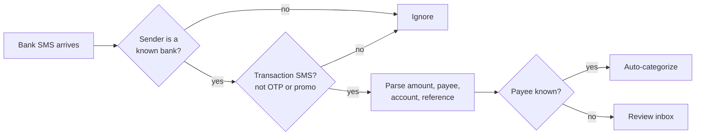

# Khata PRD

2026-09-25 · SLPS

## Overview

Khata is a free, open-source Android expense tracker. Every record stays on the phone, and the app has no permission to use the internet. It turns the transaction SMS that Indian banks already send into a categorized expense diary with charts, so there is almost nothing to type.

**Problem.** Popular Indian expense apps need an account, show ads, and upload SMS and spending data to their servers. People who care about privacy end up keeping spreadsheets by hand, and they lose track.

**Promise.** No account, no ads, no tracking, no internet. Anyone can read the source code and check that the app does not ask for the internet permission.

## Goals and non-goals

v1 turns bank SMS into a private, categorized record of your spending, with good charts and no network access.

**Goals (v1)**

- Record expenses and income automatically from bank SMS, and let users add them by hand.
- Ask once which category a payee belongs to, then remember it.
- Show where money goes: a category pie, a daily calendar heatmap and a month-by-month comparison.
- Export and import CSV, which also serves as the backup.
- Protect data at rest with an app lock and an encrypted database.
- Let users add parsers for banks we don't support yet.
- Offer the interface in English and Hindi.
- Get published on the Play Store under GPLv3, with signed APKs on GitHub.

**Non-goals (v1)**

- iOS, because iOS does not let apps read SMS.
- Cloud sync, accounts or sharing between devices.
- Spending alerts (planned, see Future features), bill reminders, investments or loans.
- Reading bank statements (PDF) or email.
- Any analytics, crash reporting or ads SDK.
- Publishing on F-Droid.

## Target users

The main users are salaried people in India who pay mostly through UPI and cards and want their spending tracked without handing their data to anyone.

| Persona | Situation | What they need from Khata |
| --- | --- | --- |
| Privacy-minded professional | Uses several cards and UPI apps; avoids apps that upload SMS | Automatic tracking that works offline and whose code they can check |
| Freelancer / business traveller | Mixes personal and work spending | Tags such as "work" to separate spending that can be reimbursed |
| Household manager | Pays rent, groceries and bills | Monthly comparison and category totals |
| Spreadsheet user | Already tracks spending by hand in Excel | CSV import and export, so their data is never locked in |

## Privacy and security principles

These are hard rules. A change that breaks one of them does not ship.

1. **No internet permission.** `android.permission.INTERNET` must never appear in the merged manifest. A CI check fails the build if any library adds it.
2. **No third-party SDKs that phone home.** No analytics, crash reporting, ads or Firebase. Dependencies are limited to AndroidX, Kotlin libraries and SQLCipher.
3. **Encrypted database.** Room on top of SQLCipher. The key is generated on the device and kept in the Android Keystore.
4. **App lock.** By default the app is unlocked with the phone's own screen lock (fingerprint, face, or the phone's PIN or pattern) through BiometricPrompt, so there is no extra PIN to forget. Users can instead set an app-only PIN, which comes with a one-time recovery code. The app locks again after a timeout the user chooses. The screen is hidden in the recent-apps view and screenshots are blocked (FLAG_SECURE). Both the lock and screenshot blocking are on by default and can be turned off in Settings.
5. **No silent cloud backup.** Android auto-backup is turned off (`allowBackup=false`), so data never goes to Google Drive behind the user's back. Backups happen only through CSV export, which the user starts.
6. **Minimum permissions.** READ_SMS and RECEIVE_SMS are requested only when the user turns on SMS import, and manual entry works without them. We never ask for SEND_SMS or contacts.
7. **Open source under GPLv3.** Builds should be reproducible so that anyone can check that the published app matches the source.

## Features

v1 has eight features, and spending alerts are planned for later. SMS parsing ships in a later milestone, so everything else must work with manual entry and CSV import.

### 1. Transactions

- Each transaction records: amount, direction (debit, credit, refund or transfer), date and time, payee (UPI ID, merchant or account), source account (bank account or card, last 4 digits), category, tags, a note, the UPI or bank reference number, and the raw SMS text when there is one.
- Add, edit and delete by hand. A transaction can be split across categories later (v2).
- **Transfers do not count as spending.** Paying a credit card bill (for example through CRED) or moving money between your own accounts is marked as a transfer and left out of spending totals. The card purchases themselves were already counted.

### 2. Categories and tags

- Each transaction has **one category**. The defaults are Food, Groceries, Travel, Rent, Work, Bills & Utilities, Shopping, Health, Entertainment and Uncategorized. Users can add, rename, recolor and archive categories.
- It can also have **any number of tags**, for example `work` or `trip-goa`.
- Charts and lists can be filtered by category, tag, account and date range.

### 3. Payee memory

- The first time a new payee appears, the app asks for a display name (such as "General Store") and a default category and tags.
- Every later transaction from that payee is filled in automatically, with no question asked again.
- Users can override the category on a single transaction without changing the saved rule. This matters for shared QR codes (for example `paytmqr…`), where one ID covers many shops.
- A Payees screen lists every saved mapping, which can be edited or merged.

### 4. Review inbox

- New transactions from unknown payees collect in a **To review** inbox with a count badge, for example "10 new today".
- Review happens one card at a time: name the payee, pick a category, add tags, then move to the next. It can be skipped, and skipped items stay Uncategorized.
- A daily summary notification is optional and stays on the device. It needs no internet, so no push service is involved.

### 5. Charts and insights

- **Category pie (donut):** spending by category for the selected period. It shows the top 5–6 categories plus "Other", and tapping a slice opens its transactions.
- **Calendar heatmap:** a GitHub-style grid of days where darker means more spent, covering the last 12 months. Tapping a day opens that day's list.
- **Monthly comparison:** bars for the last 6–12 months, optionally stacked by category, with the change against the previous month (for example "Food +18%").
- **Home summary:** income and spending this month, spent today, the top category and the number of items to review.

### 6. CSV export and import

- Export all data or a date range to a documented CSV format, saved anywhere the user picks through the Android file picker.
- Import from Khata's own CSV, or from any CSV after matching its columns (date, amount, description, category). Duplicates are skipped by reference number, or else by date, amount and payee.
- A reminder to back up is shown if there has been no export in 30 days (the interval can be changed).

### 7. SMS reading (later milestone)

Parsing happens entirely on the device, with a rule set for each sender. Kotak is built in for v1; other banks (HDFC, ICICI, Federal, Axis first) are added through custom parsers (feature 8) and become built in after launch as real samples come in. With permission, the inbox can also be imported from a chosen start date. SMS that can't be parsed go to the review inbox with their raw text, and the user can report the format by filing a GitHub issue themselves; the app never sends anything.

### 8. Custom parsers (later milestone)

Users can add a parser for any bank we don't support yet, without waiting for a release.

1. On the Khata parser website (GitHub Pages), the user pastes a sample SMS and marks the amount, payee, account and reference number.
2. The site generates a parser rule, a short text code containing a pattern and field mapping.
3. In the app, the user opens Settings > Parsers > Add, pastes the code, tests it against a recent SMS on the phone, and saves it.

Three rules keep this safe:

- **The website runs entirely in the browser.** It is a static page with no server, so the pasted SMS never leaves the user's device. The page asks users to blank out personal details anyway.
- **A parser is data, not code.** The app only accepts a declarative rule (a pattern plus field names), never executable code. This protects users from malicious parsers, and Google Play does not allow apps to download and run code.
- **Sharing is optional.** Users can submit a rule to the GitHub repo so it ships to everyone in the next release.

### Future features

**Spending alerts.** The user sets a monthly limit for a category, for example ₹20,000 for Groceries.

- A notification and an in-app banner appear at 80% of the limit and again when it is exceeded.
- A "Limits" screen shows a progress bar for each category.
- Limits reset on the 1st of each month.
- Everything runs on the device through local notifications, so no internet is needed.

## Data model

There are six tables in one encrypted SQLite database. Amounts are stored as integer paise so that no rounding errors creep in.

| Table | Key fields | Notes |
| --- | --- | --- |
| Account | id, name, type (bank / credit card / debit card / wallet), bank, last4 | Filled in automatically from SMS, and editable |
| Payee | id, identifier (UPI ID / merchant / account), display name, default category, default tags | This is the payee memory |
| Category | id, name, color, icon, archived | One per transaction |
| Tag | id, name | Linked to transactions through TransactionTag |
| Transaction | id, amount_paise, direction, timestamp, account_id, payee_id, category_id, note, reference_no, source (sms / manual / csv), raw_sms, needs_review | reference_no is unique when present, which prevents duplicates |
| TransactionTag | transaction_id, tag_id | Links transactions to tags (many-to-many) |

The CSV export has one row per transaction with these columns: date, time, amount, direction, account, payee, payee_name, category, tags (separated by "|"), note, reference_no.

## Technical approach

The app is a native Android app written in Kotlin with Jetpack Compose. It supports Android 8.0 (API 26) and newer, which covers nearly all phones in use in India.

| Area | Choice | Why |
| --- | --- | --- |
| Language / UI | Kotlin, Jetpack Compose, Material 3, with English and Hindi strings | Modern and well supported; Material 3 matches the phone's own colors (dynamic color) |
| Architecture | MVVM, one module per feature, Hilt for wiring | Easy to test, and easy for outside contributors to work in |
| Storage | Room + SQLCipher, Android Keystore for the key | Encrypted, and fully offline |
| Charts | Compose Canvas for all three charts (donut, bars and calendar heatmap), with one shared chart theme | No chart library is on the release dependency allowlist, and no library offers a GitHub-style heatmap, which needs Canvas anyway |
| Security | androidx.biometric, FLAG_SECURE | App lock and hiding the screen in recent apps |
| Background work | WorkManager | Daily summary and backup reminders |
| SMS | BroadcastReceiver for new SMS, plus a one-time inbox scan | Parsers are pure Kotlin with unit tests |
| CSV | Storage Access Framework (the system file picker) and a small CSV library | The user picks where files go, without broad storage permissions |
| Build / CI | Gradle, GitHub Actions: lint, unit tests, a check that fails if the INTERNET permission appears, reproducible release builds | Enforces the privacy promise automatically |

**SMS parser design.** Each bank has its own rules, in the same declarative format as custom parsers ([`docs/parser-rules.md`](parser-rules.md)): the engine takes the sender ID and message body and returns a transaction or nothing. The sender ID is matched by its header, for example `KOTAKB` in `JM-KOTAKB-S`. Each bank's rules are tested against real SMS samples with personal details blanked out, kept in the repo. Adding a new bank means adding its rule file (made on the parser website) and its sample SMS, which is a simple first contribution for newcomers.

## Distribution

We publish on the Play Store, and attach signed APKs to GitHub Releases. We are not publishing on F-Droid. The requirements below are from memory and need checking against the current policy pages before we submit.

**Google Play**

- [ ] Create a developer account: a one-time fee of about US$25, plus identity verification.
- [ ] New personal accounts must run a closed test with about 12 testers for 14 days before a production release.
- [ ] Submit the SMS permissions declaration form, choosing SMS-based money management as the use case, and upload a short video showing why the app needs to read SMS.
- [ ] Fill in the Data safety form: no data collected, no data shared.
- [ ] Publish a privacy policy URL, for example a page on GitHub Pages saying no data leaves the device.
- [ ] Store listing title: "Khata: Private Expense Tracker" (exactly 30 characters, the maximum).

**GitHub Releases** get signed APKs as well, for people who install apps directly.

## Milestones

We build in five milestones. The app is useful from M2 on, before any SMS parsing exists.

| Milestone | Scope | Done when |
| --- | --- | --- |
| M0 Foundation | Repo, GPLv3, CI including the check that fails if the INTERNET permission appears, encrypted Room database, app lock | The app opens behind a PIN or fingerprint, and CI is green |
| M1 Manual tracking | Add, edit and delete transactions; categories, tags, accounts, payee memory, income, English and Hindi interface | You can track a month of spending by hand |
| M2 Charts and CSV | Category pie, calendar heatmap, monthly comparison, CSV export and import, backup reminder | You can import an existing spreadsheet and see all three charts |
| M3 SMS reading | Built-in Kotak parsers, other banks through custom parsers; inbox scan; review inbox; transfer detection; custom parser website and import | A week of real SMS is recorded correctly with no double counting |
| M4 Release | Closed test with 12 testers, Play forms and video, GitHub release APK, store listing | Live on the Play Store |

## Success metrics and risks

**Success metrics.** The app has no analytics, so success is measured only from public signals and our own tests.

- At least 95% of real sample SMS from supported banks are parsed correctly, measured by the parser test suite.
- No double-counted spending in a month of our own real data.
- Play Store rating of 4.3 or higher, plus Play Store installs, and stars and outside contributors on GitHub.
- The number of GitHub issues asking for new banks, which shows real demand.

**Risks**

| Risk | Impact | Mitigation |
| --- | --- | --- |
| Google rejects the SMS permission declaration | No automatic tracking on Play | Manual entry and CSV still work fully; the GitHub APK keeps SMS reading; the demo video and wording are prepared carefully |
| Banks change their SMS format | Transactions stop being recorded | Unparsed SMS go to the review inbox with their raw text; each parser is its own file and has tests |
| Lost phone or uninstall wipes the data | The user loses their history | A backup reminder, plus a clear warning on first launch and before uninstalling where possible |
| Forgotten PIN locks the user out | The data cannot be recovered | Use the phone's screen lock by default; an app-only PIN comes with a one-time recovery code |
| "Khata" is a common word used by many shop-ledger apps, and may be linked with Khatabook | Weak discoverability; possible trademark complaint | "khata" is an everyday term; a distinct store title, icon and package (`com.openhand.khata`) set the app apart; search trademarks before publishing |
